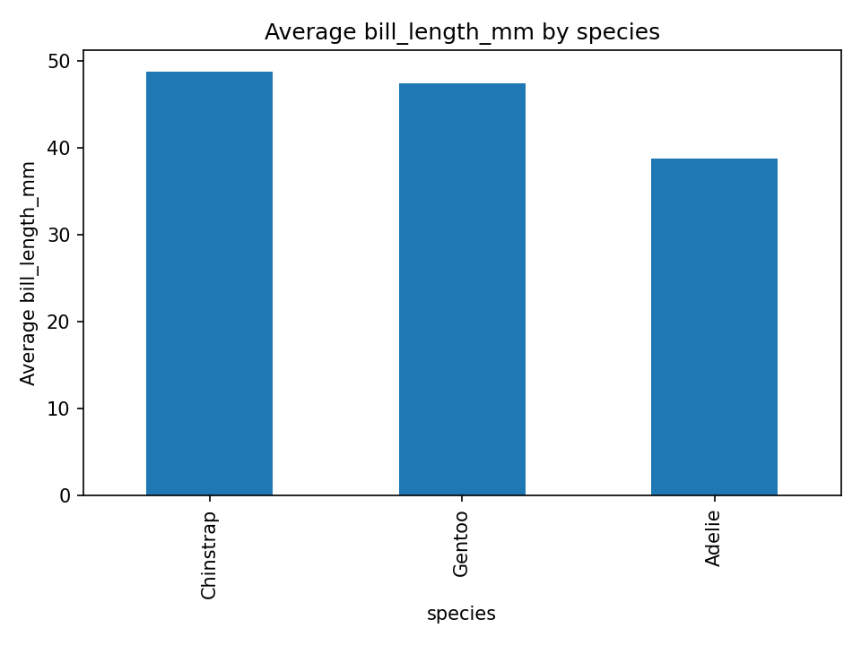

# DATA101 Activity 1

## Dataset chosen
Option A: Penguins  
https://raw.githubusercontent.com/mwaskom/seaborn-data/master/penguins.csv  
Recommended columns: `species` (category), `bill_length_mm` (numeric)

## How to run
```bash
python3 -m venv .venv
source .venv/bin/activate   # Windows: .\.venv\Scripts\Activate.ps1
pip install pandas matplotlib
pip freeze > requirements.txt
python analyze.py
```

## What it does
- Prints dataset summary (rows/cols, columns list, first 5 rows, grouped averages)



## Reflection (write 3–5 sentences)
What was the hardest part?
- To be honest, the network wasn’t that good when we did the activity. The hardest part was actually waiting for the libraries to finish downloading, even when we used uv to speed things up. This slowed down progress as we could not actually run the program without having all dependencies.

What did you learn about Git commits (small commits, staging, meaningful messages)?
- It is important to ensure that your commit messages are meaningful as that would lead to a more productive codebase. Smaller commits can lead to an easier time when troubleshooting. The staging allows for more granular control with the versions.
